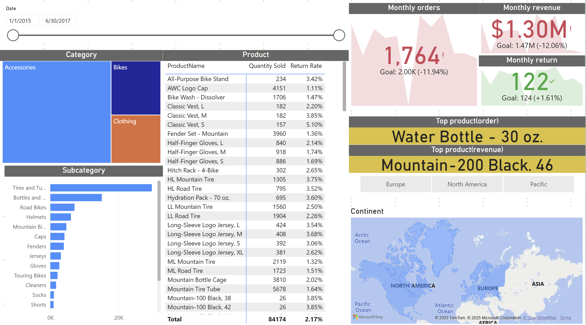
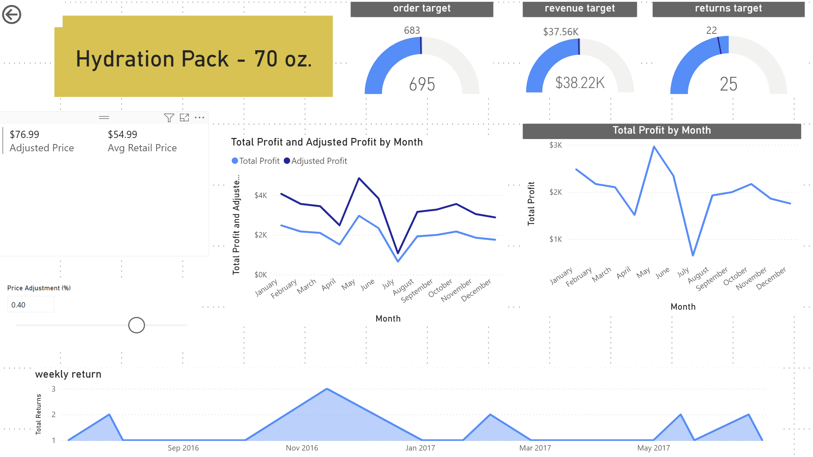
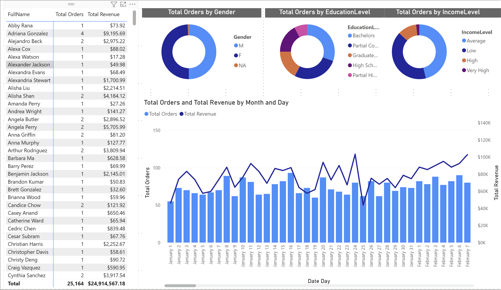

## 📊 Project Overview

This project is an interactive **Power BI dashboard** built using the **AdventureWorks** sample dataset.  
The dashboard is designed to answer **business-critical questions** related to:

- Sales performance and trends  
- Product profitability and top-selling items  
- Customer behavior and segmentation  

The goal of this project is to demonstrate **data modeling, analytical thinking, and dashboard storytelling**, not just visual design.

---

## 🧠 Business Questions Answered

- Which products generate the highest revenue and profit?
- How do sales perform over time?
- Which customers contribute the most to total revenue?
- What product categories drive business growth?

---

## 📈 Dashboard Pages
### 1️⃣ Product Analysis Overview

**Purpose:**  
Provides a high-level view of product performance across categories.

**What it shows:**
- Which products and categories drive sales
- Product-level quantity sold vs return rate

**Why this matters:**  
Helps identify high-performing products and products that generate risk due to high returns.

### 2️⃣ Product Detail – Hydration Pack (70 oz)

**What is this?**  
Detailed performance analysis of a single product.

**Key facts from the dashboard:**
- Orders exceeded target
- Revenue exceeded target
- Returns were above acceptable threshold

**Why this matters:**  
Demonstrates product-level drill-down to identify hidden operational risks behind strong sales.

### 3️⃣ Customer Analysis

**Purpose:**  
Analyzes customer contribution to total revenue.

**What it shows:**
- Revenue by customer
- Customer segmentation patterns

**Why this matters:**  
Helps businesses focus on high-value customers and improve retention strategies.

## 🛠 Tools & Skills Demonstrated

- Power BI
- DAX
- Data Modeling
- Business Analysis
- Dashboard Storytelling

